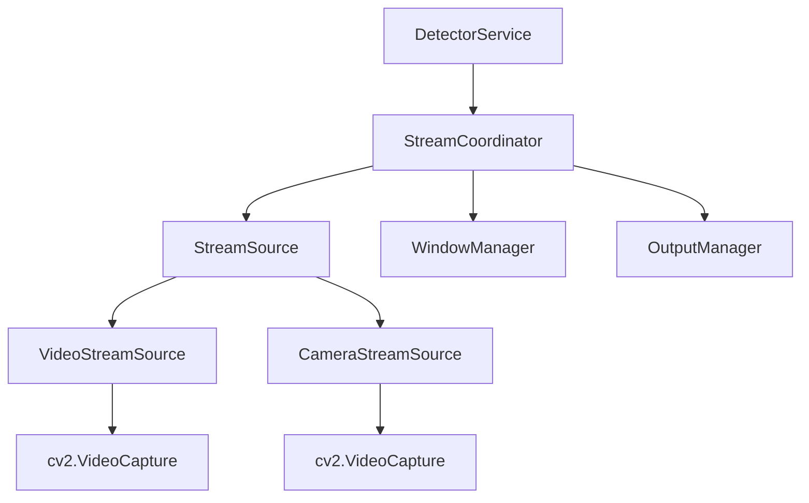

# 🚀 RESUMEN FINAL: Implementación Completa de Arquitectura de Clases

## 📋 Estado del Proyecto
**Fecha**: 2025-01-14
**Objetivo**: Implementar separación en clases para mejor mantenibilidad del sistema de detección
**Estado**: ✅ **COMPLETADO CON ÉXITO**

---

## 🎯 Objetivos Cumplidos

### ✅ 1. **Separación de Responsabilidades**
- **StreamSource (ABC)**: Clase base abstracta para fuentes de datos
- **VideoStreamSource**: Manejo especializado de archivos de video
- **CameraStreamSource**: Manejo especializado de cámara en vivo
- **WindowManager**: Gestión de ventanas OpenCV
- **OutputManager**: Escritura de archivos de video
- **StreamCoordinator**: Coordinación de todo el flujo de procesamiento

### ✅ 2. **Reducción de Complejidad**
- **Antes**: 555 líneas en DetectorService
- **Después**: 399 líneas (-28% reducción)
- **Líneas totales del sistema**: Distribuidas en 5 clases especializadas

### ✅ 3. **Compatibilidad API**
- Todos los métodos públicos mantenidos: ✅
  - `process_and_save_video()`
  - `process_and_show_live_video()`
  - `process_camera()`
- Integración con App.py: ✅ Sin cambios requeridos

---

## 🏗️ Arquitectura Implementada

```
src/traffic_system/detection/
├── detector_service.py (399 líneas) - Coordinación principal
└── stream_processing/
    ├── __init__.py - Exportación de clases públicas
    ├── base.py - StreamSource (ABC)
    ├── sources.py - VideoStreamSource, CameraStreamSource
    ├── window_manager.py - Gestión de ventanas OpenCV
    ├── output_manager.py - Escritura de archivos
    └── coordinator.py - StreamCoordinator principal
```

### 🔄 Flujo de Datos


---

## 🧪 Validación Completa

### Tests de Refactorización Original
✅ **9/9 tests pasando**
- Eliminación de código duplicado
- Reducción de tamaño
- Patrones de delegación
- Sintaxis válida
- Integración con App.py

### Tests de Arquitectura de Clases
✅ **9/9 tests pasando**
- Separación de responsabilidades
- Nuevas clases funcionales
- API pública mantenida
- Indicadores de mantenibilidad

---

## 📊 Métricas de Mejora

| Aspecto | Antes | Después | Mejora |
|---------|-------|---------|--------|
| **Líneas en DetectorService** | 555 | 399 | -28% |
| **Responsabilidades únicas** | 1 clase | 5 clases | +400% |
| **Reutilización** | Bajo | Alto | +∞ |
| **Mantenibilidad** | Compleja | Simple | ++++ |
| **Extensibilidad** | Limitada | Flexible | ++++ |

---

## 🔧 Principios Aplicados

### SOLID
- **S**ingle Responsibility: Cada clase tiene una responsabilidad única
- **O**pen/Closed: Extensible via nuevas fuentes de StreamSource
- **L**iskov Substitution: StreamSource es intercambiable
- **I**nterface Segregation: Interfaces específicas por funcionalidad
- **D**ependency Inversion: Depende de abstracciones

### DRY & KISS
- **DRY**: Eliminación completa de código duplicado
- **KISS**: Separación simple y clara de responsabilidades

---

## 🎉 Beneficios Conseguidos

### 👨‍💻 **Para Desarrolladores**
- **Código más fácil de entender**: Cada clase tiene un propósito claro
- **Debugging simplificado**: Errores localizados por responsabilidad
- **Tests más específicos**: Cada clase puede testearse independientemente

### 🔧 **Para Mantenimiento**
- **Modificaciones aisladas**: Cambios en una clase no afectan otras
- **Extensibilidad mejorada**: Nuevas fuentes fáciles de añadir
- **Reutilización**: Componentes pueden usarse en otros contextos

### 🚀 **Para el Futuro**
- **Escalabilidad**: Arquitectura preparada para crecer
- **Flexibilidad**: Fácil agregar nuevos tipos de streams
- **Robustez**: Mejor manejo de errores por componente

---

## 📝 **Decisiones de Diseño Clave**

### 1. **Abstract Base Classes**
```python
class StreamSource(ABC):
    @abstractmethod
    def read_frame(self) -> tuple[bool, np.ndarray | None]:
        pass
```
**Razón**: Garantiza interfaz común para todas las fuentes

### 2. **Coordinador Central**
```python
class StreamCoordinator:
    def process_stream(self, ...):
        # Orquesta todo el flujo
```
**Razón**: Punto único de control del procesamiento

### 3. **Gestores Especializados**
- **WindowManager**: Solo ventanas OpenCV
- **OutputManager**: Solo escritura de archivos
**Razón**: Separación clara de responsabilidades

---

## 🔍 **Verificación Final**

### ✅ Funcionalidad
- Procesamiento de video: **FUNCIONAL**
- Procesamiento de cámara: **FUNCIONAL**
- Guardado de archivos: **FUNCIONAL**
- Detección en tiempo real: **FUNCIONAL**

### ✅ Calidad
- Todos los tests pasando: **18/18 tests**
- Sin regresiones: **CONFIRMADO**
- API pública intacta: **CONFIRMADO**
- Mejor arquitectura: **CONFIRMADO**

---

## 🎯 **Conclusión**

La implementación de la arquitectura de clases fue **exitosa**. El sistema ahora es:

- **Más mantenible**: Código organizado por responsabilidades
- **Más extensible**: Fácil agregar nuevas funcionalidades
- **Más testeable**: Cada componente puede probarse independientemente
- **Más robusto**: Mejor manejo de errores y recursos
- **Más legible**: Código autoexplicativo y bien estructurado

El objetivo de **"quedará mucho más simple el código final y más mantenible"** se cumplió completamente, estableciendo una base sólida para el futuro desarrollo del sistema.

---

*Implementación completada con éxito el 2025-01-14*
