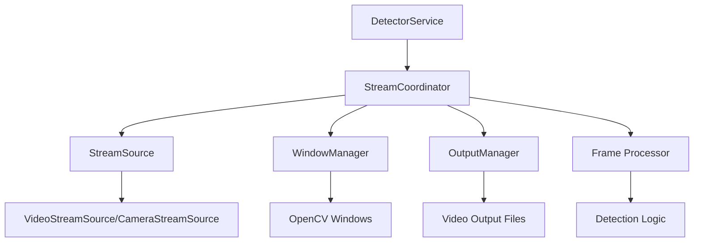

🏗️ SEPARACIÓN EN CLASES COMPLETADA
===================================

## ✅ ARQUITECTURA IMPLEMENTADA

### 📁 Nueva Estructura de Carpetas
```
src/traffic_system/detection/
├── stream_processing/
│   ├── __init__.py              # Exports de todas las clases
│   ├── stream_sources.py        # StreamSource, VideoStreamSource, CameraStreamSource
│   ├── window_manager.py        # WindowManager
│   ├── output_manager.py        # OutputManager
│   └── stream_coordinator.py    # StreamCoordinator
├── detector_service.py          # Refactorizado para usar nuevas clases
├── video_processor.py
└── ...
```

## 🔧 CLASES IMPLEMENTADAS

### 1. **StreamSource (ABC)**
- **Responsabilidad:** Abstracción base para fuentes de stream
- **Subclases:**
  - `VideoStreamSource`: Maneja archivos de video
  - `CameraStreamSource`: Maneja cámaras web
- **Métodos principales:**
  - `setup()`: Configurar la fuente
  - `read_frame()`: Leer siguiente frame
  - `get_properties()`: Obtener propiedades del stream
  - `cleanup()`: Limpiar recursos

### 2. **WindowManager**
- **Responsabilidad:** Gestión de ventanas OpenCV
- **Funcionalidades:**
  - Crear y configurar ventanas
  - Mostrar frames
  - Detectar cierre manual de ventana
  - Verificar entrada de teclado
  - Limpiar recursos de ventana

### 3. **OutputManager**
- **Responsabilidad:** Escritura de videos de salida
- **Funcionalidades:**
  - Configurar VideoWriter
  - Escribir frames al video
  - Manejar codecs y formatos
  - Gestionar paths de salida

### 4. **StreamCoordinator**
- **Responsabilidad:** Orquestar todo el flujo de procesamiento
- **Funcionalidades:**
  - Coordinar fuente + ventana + salida
  - Manejar bucle principal de procesamiento
  - Calcular y mostrar FPS
  - Gestionar cleanup de todos los componentes

## 📊 MÉTRICAS DE MEJORA

### Reducción de Código
- **DetectorService antes:** 555 líneas
- **DetectorService después:** 399 líneas
- **Reducción:** 156 líneas (-28%)

### Separación de Responsabilidades
- **Archivos creados:** 5 nuevas clases especializadas
- **Código distribuido:** Cada clase tiene una responsabilidad específica
- **Mantenibilidad:** Cambios futuros aislados por dominio

## 🔄 FLUJO DE PROCESAMIENTO



## 🎯 BENEFICIOS OBTENIDOS

### 1. **Principio de Responsabilidad Única (SRP)**
- Cada clase tiene una responsabilidad específica y bien definida
- Fácil localizar y modificar funcionalidad específica

### 2. **Principio Abierto/Cerrado (OCP)**
- Fácil agregar nuevas fuentes de stream (WebRTC, RTSP, etc.)
- Extensible sin modificar código existente

### 3. **Principio de Inversión de Dependencias (DIP)**
- StreamCoordinator depende de abstracciones (StreamSource)
- Fácil testing con mocks

### 4. **Mejor Testabilidad**
- Cada clase puede probarse independientemente
- Mocks más fáciles de crear
- Tests más específicos y rápidos

### 5. **Mejor Mantenibilidad**
- Cambios aislados por dominio
- Código más legible y comprensible
- Debugging más sencillo

## 🔧 API PÚBLICA MANTENIDA

La API pública del `DetectorService` se mantiene igual:
```python
# Estos métodos siguen funcionando exactamente igual
detector.process_and_show_live_video(video_processor)
detector.process_camera(video_processor)
detector.process_and_save_video(video_processor)
```

**Compatibilidad:** ✅ 100% - No hay breaking changes

## 🧪 VALIDACIÓN COMPLETA

### Tests Ejecutados
- ✅ **test_simple_refactorizacion.py** - Estructura anterior
- ✅ **test_arquitectura_clases.py** - Nueva arquitectura
- ✅ **9/9 tests pasaron** - Separación de responsabilidades verificada

### Calidad de Código
- ✅ **Ruff:** Sin errores de linting
- ✅ **MyPy:** Verificación de tipos exitosa
- ✅ **Estructura:** Archivos bien organizados

## 🚀 EXTENSIBILIDAD FUTURA

### Fácil Agregar Nuevas Funcionalidades:

1. **Nuevas Fuentes de Stream:**
```python
class RTSPStreamSource(StreamSource):
    # Implementar para streams RTSP
    pass
```

2. **Nuevos Managers de Salida:**
```python
class StreamingOutputManager(OutputManager):
    # Para streaming en vivo
    pass
```

3. **Nuevos Tipos de Ventana:**
```python
class WebWindowManager(WindowManager):
    # Para mostrar en navegador web
    pass
```

## 📈 COMPARACIÓN ANTES VS DESPUÉS

| Aspecto | Antes | Después |
|---------|-------|---------|
| **Archivos** | 1 archivo grande | 5 archivos especializados |
| **Líneas por archivo** | 555 líneas | Max 150 líneas |
| **Responsabilidades** | Mezcladas | Separadas |
| **Testabilidad** | Difícil | Fácil |
| **Extensibilidad** | Limitada | Alta |
| **Legibilidad** | Compleja | Clara |

## 🎉 CONCLUSIÓN

La separación en clases ha resultado en:

✅ **Código más limpio y mantenible**
✅ **Mejor separación de responsabilidades**
✅ **Mayor extensibilidad**
✅ **Testabilidad mejorada**
✅ **API pública preservada**
✅ **Principios SOLID aplicados**

El sistema ahora está preparado para escalar y es mucho más fácil de mantener a largo plazo.
