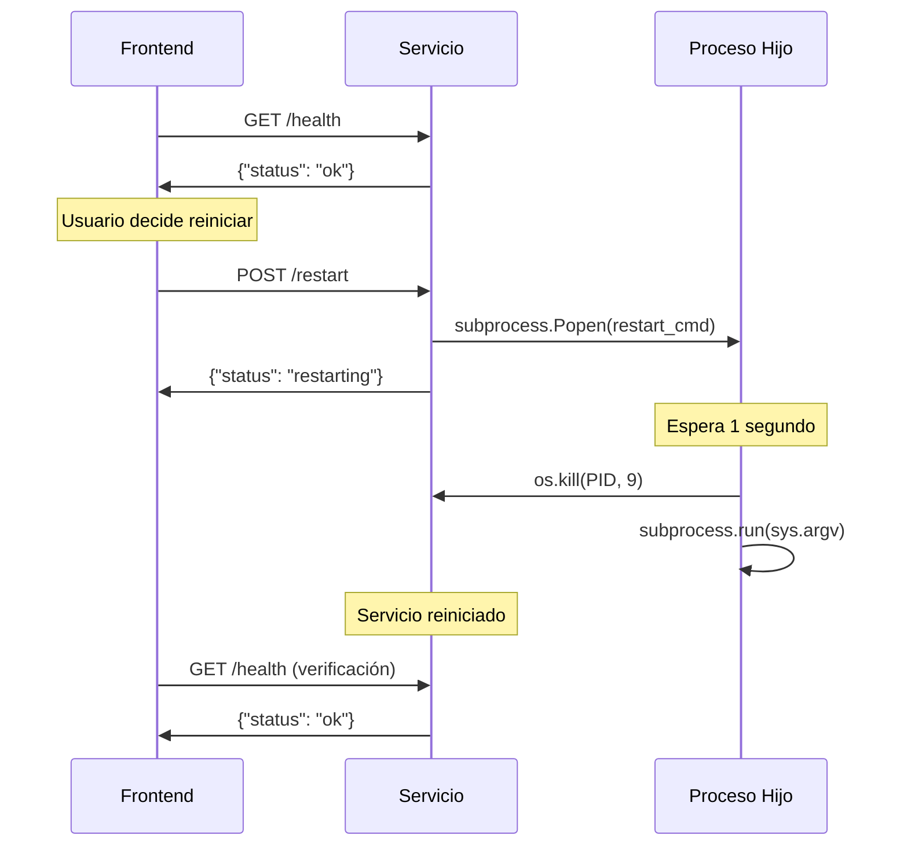

# 🔌 APIs de Servicios Remotos

Documentación completa de los endpoints disponibles en servicios remotos (decision-agent, reporting-service) ejecutándose en contenedores Docker.

## 📋 Servicios Soportados

| Servicio | Puerto | Endpoints Disponibles |
|----------|--------|----------------------|
| **Decision Agent** | 8080 | `/health`, `/restart` |
| **Reporting Service** | 8081 | `/health`, `/restart` |

## 🩺 Health Check API

### Endpoint
```
GET /health
```

### Propósito
Verificar que el servicio está ejecutándose y responde correctamente.

### Response Exitosa
```json
{
  "status": "ok"
}
```
**Status Code**: `200 OK`

### Response de Error
No hay respuesta o timeout (servicio no disponible).

### Uso desde Frontend
```python
# En RemoteServiceController
status = remote_controller.get_service_status("decision")
# Retorna: "running", "stopped", "timeout", "error", "connection_error"
```

### Características Técnicas
- **Timeout**: 2 segundos
- **Retry**: 2 intentos máximo
- **Cache**: 3 segundos de duración
- **Método HTTP**: GET únicamente

## 🔄 Restart API

### Endpoint
```
POST /restart
```

### Propósito
Reiniciar el servicio de forma segura usando process spawning.

### Request
```http
POST /restart HTTP/1.1
Host: service-ip:port
Content-Type: application/json
```

**Sin parámetros requeridos**

### Response Exitosa
```json
{
  "status": "restarting"
}
```
**Status Code**: `200 OK`

### Response de Error
```json
{
  "status": "error",
  "message": "Descripción del error"
}
```
**Status Code**: `500 Internal Server Error`

### Método de Reinicio
1. **Process Spawning**: Crea proceso independiente con `subprocess.Popen`
2. **Delay**: Espera 1 segundo antes del reinicio
3. **Kill**: Usa `os.kill(PID, 9)` para terminar proceso actual
4. **Restart**: Ejecuta `subprocess.run(sys.argv)` para relanzar

### Uso desde Frontend
```python
# En RemoteServiceController
result = remote_controller.restart_service("decision")

if result["success"]:
    print("✅ Reinicio iniciado")
    # Verificar después de unos segundos
    time.sleep(3)
    status = remote_controller.get_service_status("decision")
else:
    print(f"❌ Error: {result['error']}")
```

## 🔗 Flujo Integrado Health Check + Restart



## ⚙️ Configuración

Los servicios deben estar configurados en `config.yaml`:

```yaml
services:
  remote:
    decision:
      ip: "192.168.1.100"  # IP del contenedor Docker
      port: 8080
    reporting:
      ip: "192.168.1.100"
      port: 8081
```

## 🚀 Implementación en Servicios

### En run_decision_agent.py y run_reporting_service.py:

```python
from flask import Flask, jsonify
import subprocess
import sys
import os

def create_health_server() -> Flask:
    app = Flask(__name__)

    @app.route("/health", methods=["GET"])
    def health_check():
        return jsonify({"status": "ok"})

    @app.route("/restart", methods=["POST"])
    def restart_service():
        try:
            current_pid = os.getpid()
            python_executable = sys.executable
            script_args = sys.argv.copy()
            current_dir = os.getcwd()

            restart_cmd = [
                python_executable, "-c",
                f"import time, os, subprocess; "
                f"time.sleep(1); "
                f"os.kill({current_pid}, 9); "
                f"subprocess.run({script_args}, cwd='{current_dir}')"
            ]

            subprocess.Popen(
                restart_cmd,
                cwd=current_dir,
                stdout=subprocess.DEVNULL,
                stderr=subprocess.DEVNULL
            )

            return jsonify({"status": "restarting"})

        except Exception as e:
            return jsonify({"status": "error", "message": str(e)}), 500

    return app
```

## 🐛 Troubleshooting

### Health Check

| Error | Causa | Solución |
|-------|-------|----------|
| `connection_error` | Servicio no accesible | Verificar contenedor Docker ejecutándose |
| `timeout` | Servicio lento | Aumentar timeout o verificar carga del sistema |
| `error` | HTTP 500/respuesta inválida | Revisar logs del servicio |

### Restart

| Error | Causa | Solución |
|-------|-------|----------|
| `HTTP 500` | Error interno reinicio | Revisar logs del servicio |
| `No se pudo conectar` | Servicio no accesible | Verificar conectividad |
| `Timeout` | Servicio no responde | Reintentar, servicio puede estar ocupado |

## 📊 Monitoreo y Logs

### Frontend
- **Toast notifications** para feedback de operaciones
- **Estado visual** con emojis (🟢/🔴/⚠️)
- **Confirmación obligatoria** antes de reiniciar

### Servicios
```python
logger.info(f"Iniciando reinicio del servicio (PID: {current_pid})")
logger.info("Proceso de reinicio iniciado - servicio se reiniciará en 1 segundo")
```

## 🔒 Consideraciones de Seguridad

- **Solo servicios autorizados**: Decision y Reporting únicamente
- **Confirmación requerida**: Dialog de confirmación en frontend
- **Timeout limitado**: 2 segundos máximo para operaciones
- **Error handling robusto**: Manejo de todas las excepciones posibles
- **Logs detallados**: Para auditoría y debugging

## 🔗 Referencias

- [Frontend Usage Guide](../frontend_usage.md)
- [Docker Configuration](../../docker/README.md)
- [Service Status Enums](../../src/traffic_system/frontend/service_status.py)
